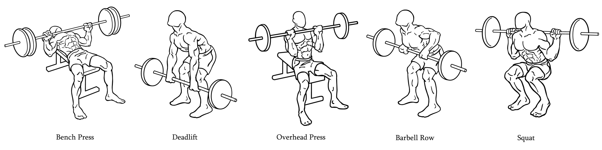

# barbell Exercises Prediction

This repository was made with the aim of create Python scripts to process, visualize, and model accelerometer and gyroscope data to create a machine learning model that can classify barbell exercises. The data is from [Mbientlab's WristBand Sensor Research Kit](https://mbientlab.com/) and was collected during gym workouts where participants were performing various barbell exercises.

**Exercises**




<br>

**Goal**
- Classify barbell exercises

## Installation
1. First, it's needed [Anconda Distribution](https://www.anaconda.com/download?utm_source=anacondadoc&utm_medium=documentation&utm_campaign=download&utm_content=topnavalldocs) installed in the system. 

2. With Anconda already installed,deactivate the default environment if it's activated.
```bash
conda deactivate
```

3. Run in the project's root directory the following code to create the new env. 
 Run in the terminal: 
```bash
conda env create -f environment.yml
```

4 . Now it's time to activate the env.

```bash
conda activate env_name
```

## References

1. [Full Machine Learning Project - by Dave Ebbelaar](https://www.youtube.com/watch?v=cCONIdrM2VI&list=PL-Y17yukoyy0sT2hoSQxn1TdV0J7-MX4K)

2. The original code is associated with the book titled "Machine Learning for the Quantified Self" authored by Mark Hoogendoorn and Burkhardt Funk and published by Springer in 2017. The website of the book can be found on [ml4qs.org](https://ml4qs.org/).

> Hoogendoorn, M. and Funk, B., Machine Learning for the Quantified Self - On the Art of Learning from Sensory Data, Springer, 2017.
